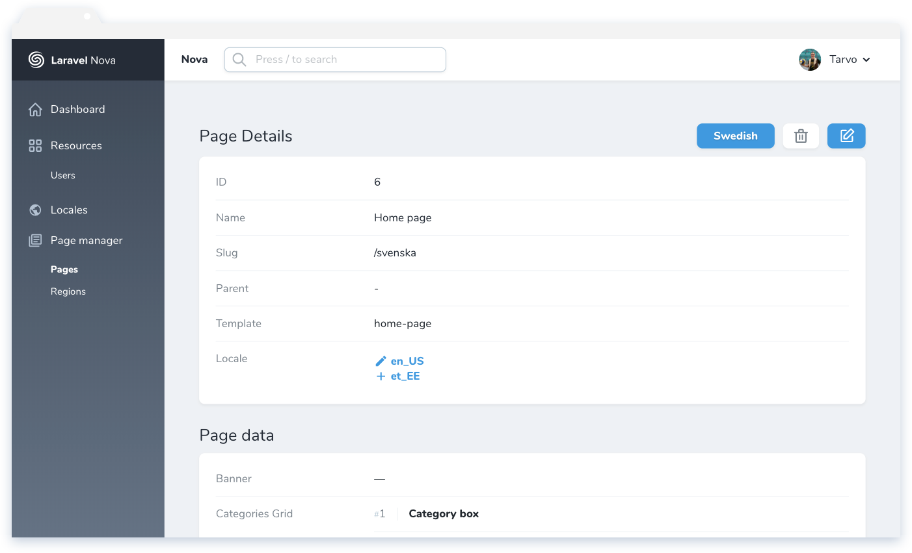
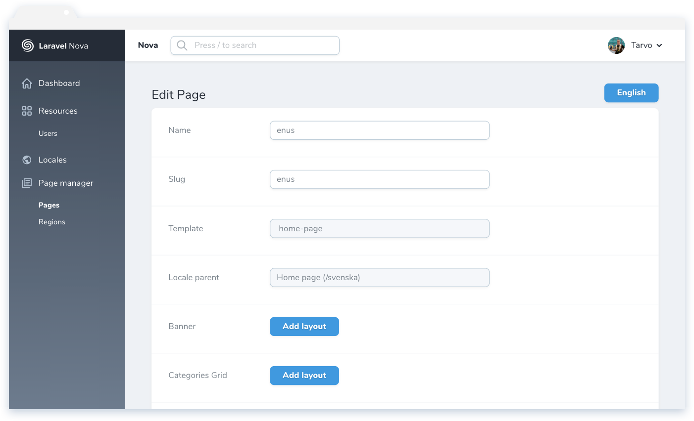
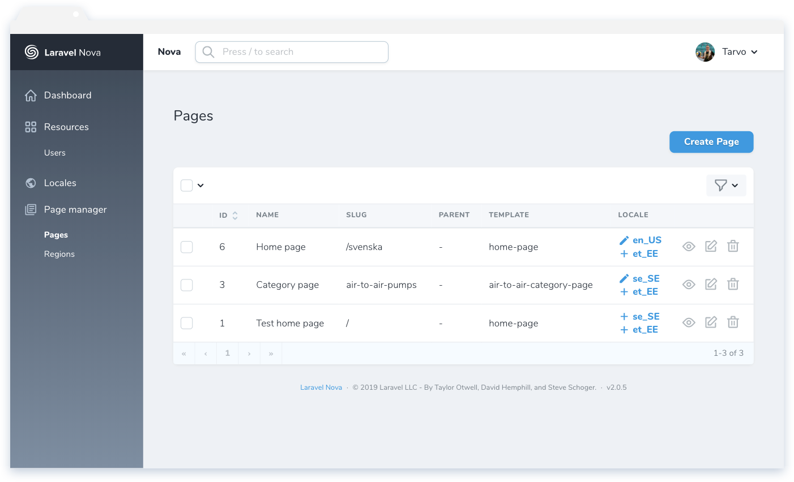

# Nova Locale Field

This [Laravel Nova](https://nova.laravel.com) package allows you to manage multiple localisations of a model.

## Screenshots







## Installation

Install the package in a Laravel Nova project via Composer:

```bash
composer require optimistdigital/nova-locale-field
```

## Usage

### Preparing the models and database

This field requires a few database changes - namely, the model requires two new columns: one for the locale and one to reference the locale parent model.

You can set the column names to anything you want. The column names are passed to the field when creating it.

| Column           | Suggested name     | Type (MySQL / Eloquent) | Nullable | Example value | Description                                                                                                |
| ---------------- | ------------------ | ----------------------- | -------- | ------------- | ---------------------------------------------------------------------------------------------------------- |
| Locale           | `locale`           | `VARCHAR` / `string`    | NO       | `en_US`       | A text column for the locale, maximum size depends on which types of locales you use (ie `en` vs `en_US`). |
| Locale parent ID | `locale_parent_id` | `BIGINT` / `bigInteger` | YES      | `1`           | A locale parent reference column (foreign key, though the actual foreign key is optional)                  |

Example migration:

```php
Schema::table('some_model_table', function ($table) {
    $table->string('locale');
    $table->bigInteger('locale_parent_id')->nullable();

    // Optionally, add a foreign key
    $table->foreign('locale_parent_id')->references('id')->on('some_model_table');
});
```

### Creating the field

This field has slightly different constructor (`::make()`) arguments than other Nova fields.

| #   | Argument                | Type   | Description                                                                                                                          |
| --- | ----------------------- | ------ | ------------------------------------------------------------------------------------------------------------------------------------ |
| 1   | \$name                  | string | Display name of the field, visible to the user as the column title in the index field and as the name of the locale selection field. |
| 2   | \$localeAttribute       | string | The attribute (column) name of the locale value.                                                                                     |
| 3   | \$localeParentAttribute | string | The attribute (column) name for the locale parent id.                                                                                |

```php
use OptimistDigital\NovaLocaleField\LocaleField;

LocaleField::make('Locale', 'locale', 'locale_parent_id')
    ->locales(['en' => 'English', 'et' => 'Estonian']) // Optional when you've set a default
    ->maxLocalesOnIndex(4) // Optional, defaults to 4
```

## Options

Possible options you can pass to the field using the option name as a function, ie `->maxLocalesOnIndex(4)`.

| Option              | Type  | Default | Description                                                                                                          |
| ------------------- | ----- | ------- | -------------------------------------------------------------------------------------------------------------------- |
| `locales`           | array | []      | Locales in an array as key-value pairs (`['id' => 'value']`).                                                        |
| `maxLocalesOnIndex` | int   | 4       | The amount of locales shown on the index view. If this is exceeded, the locales are only visible on the detail view. |

## Configuration

### Config file

You can publish the config file and edit the default values (besides locales) there.

To publish the configuration file, run the following artisan publish command:

```bash
php artisan vendor:publish --provider="OptimistDigital\NovaLocaleField\FieldServiceProvider" --tag="config"
```

### Default locales

The default locales can be defined in the config file via a closure or an array.

This default value can be overriden on a per-field basis using the `->locales([])` function directly on the field.

## Filters

The package also provides a select type filter for the locales.

### Using the locale filter

To use the locale filter, just add it to the array your resources' `filters()` function returns. Pass in the name of the locale field as the only argument in the `constructor` or the static `make` function.

You can also override the default displayed locale options by calling `->locales([])` on the filter. This is optional and the filter will use the default locales when not set.

```php
use \OptimistDigital\NovaLocaleField\Filters\LocaleFilter;

public function filters(Request $request)
    {
        return [
            LocaleFilter::make('locale')
                ->locales(NovaEcommerce::getLocales()), // <- Optional

            // OR

            new LocaleFilter('locale'),
        ];
    }
```

## Credits

- [Tarvo Reinpalu](https://github.com/Tarpsvo)

## License

This project is open-sourced software licensed under the [MIT license](LICENSE.md).
